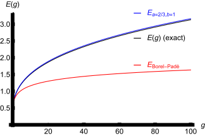
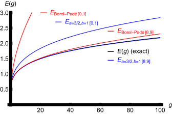

# A new method to sum divergent power series: educated match

#### [Gabriel Álvarez](mailto:galvarez@fis.ucm.es)

#### [Harris J. Silverstone](mailto:hjsilverstone@jhu.edu)

> #### Abstract
>
> We present a method to sum Borel- and Gevrey-summable asymptotic series by
> matching the series to be summed with a linear combination of asymptotic
> series of known functions that themselves are scaled versions of a single,
> appropriate, but otherwise unrestricted, function $`\Phi`$. Both the scaling
> and linear coefficients are calculated from Padé approximants of a series
> transformed from the original series by $`\Phi`$. We discuss in particular the
> case that $`\Phi`$ is (essentially) a confluent hypergeometric function, which
> includes as special cases the standard Borel-Padé and Borel-Leroy-Padé
> methods. A particular advantage is the mechanism to build knowledge about the
> summed function into the approximants, extending their accuracy and range even
> when only a few coefficients are available. Several examples from field theory
> and Rayleigh-Schrödinger perturbation theory illustrate the method.

> ##### PACS numbers
>
> 02.30.Lt; 31.15.xp

## {\`\`} Introduction

Summation of divergent asymptotic expansions has led to a vast literature from
both mathematical and physical points of view. The mathematical goal is often to
assign a standard sum to a series whose coefficients satisfy certain growth
conditions and whose sum satisfies certain conditions at
infinity \[[^HA49][^RA93]\]. The physical literature focuses on a wide range of
specialized, computational methods. Especially since the work carried out in the
1970’s on the coupling constant analyticity of anharmonic
oscillators \[[^GR70][^SI70][^HS78]\], two summation methods have become
dominant: Padé approximants and Borel summation. Both have been found useful in
fields as diverse as quantum mechanics, statistical mechanics, quantum field
theory, and string theory. Padé approximants are most often directly used
empirically (see, for example, the recent study on the existence of an
ultraviolet zero for the six-loop beta function of the $`\lambda\Phi_{4}^{4}`$
theory \[[^SH16]\]), and at times with new, alternative transformation
procedures \[[^AM07]\]. Borel summability has been rigorously proved in several
instances. The analytic continuation implicit in the Borel summation process
poses a practical problem that has been dealt with in essentially two ways:
conformal mappings \[[^LG77][^ZJ02][^ZJ10]\], and Borel-Padé approximants. In
the latter, the analytic continuation is again performed empirically by Padé
approximants of the Borel-transformed series \[[^GR70][^BA76][^FR85][^AL00]\].
Most recently, Mera, Pedersen, and Nikolić \[[^ME15][^MH16]\] and Pedersen,
Mera, and Nikolić \[[^PE16]\] have developed a method that uses hypergeometric
functions to sum perturbation theory series using only a few terms.

Initially motivated in part by the papers of Mera, Pedersen, and Nikolić, we
present here a new method to build concise, explicit, analytic approximants to
the Borel or Gevrey sum of an asymptotic power series. These approximants
_match_ the series to be summed with a linear combination of asymptotic series
of known functions. The known functions are scaled versions of a single function
$`\Phi`$, and both the scaling and linear coefficients are readily calculated
from Padé approximants of a transformed series determined by the original series
and by $`\Phi`$. If $`\Phi`$ is taken to be (essentially) a confluent
hypergeometric function, the new method includes as special cases the standard
Borel-Padé and Borel-Leroy-Padé summation methods. Even more important, prior
additional (i.e., _educated_) knowledge about the summed function can be built
into the approximants via the function $`\Phi`$, sometimes dramatically
extending the accuracy and range of the approximants. The “linear combination”
here is similar to the linear combination of the Janke-Kleinert resummation
algorithm, which is described as “re-expanding the asymptotic expansion in a
complete set of basis functions”, and which is mathematically equivalent to
conformal mapping techniques \[[^KL01]\]. Our method, in contrast, is
essentially linked to the theory of Padé approximants.

## {\`\`} $`\Phi`$-Padé approximants

Our goal is to approximate the Borel sum $`\psi(z)`$ of a divergent power
series,

```math
\psi(z)\sim\sum_{k=0}^{\infty}d_{k}z^{k},
```

using _any appropriate known function_ $`\Phi(z)`$ with its own Borel-summable
series,

```math
\Phi(z)\sim\sum_{k=0}^{\infty}f_{k}(-z)^{k}.
```

The method is at the same time hidden in, and a generalization of, the
Borel-Padé summation method \[[^AL00]\], which we briefly review.

Let us denote by $`P_{n-1}(z)/Q_{n}(z)`$ the $`[n-1,n]`$ Padé approximant of the
Borel transform of the series (\[`eq:psi`\]),

```math
\hat{\psi}_{\mathrm{B}}(z)=\sum_{k=0}^{\infty}\frac{d_{k}}{k!}z^{k},
```

and let us assume that $`Q_{n}(z)`$ has only simple zeros. Partial fraction
expansion,

```math
\frac{P_{n-1}(z)}{Q_{n}(z)}=\sum_{j=1}^{n}\frac{r_{j}}{z-z_{j}},
```

and term-by-term integration lead to the standard Borel-Padé approximant
$`\psi_{\mathrm{B},[n-1,n]}(z)`$ to $`\psi(z)`$,

where we define $`E_{\mathrm{Euler}}(z)`$ by

```math
E_{\mathrm{Euler}}(z)=\int_{0}^{\infty}\frac{\rme^{-t}}{1+zt}\rmd t=z^{-1}\rme^{1/z}E_{1}(1/z),
```

and where $`E_{1}(1/z)`$ is a standard version of the exponential integral (see
chapter 5 of reference \[[^AS70]\]).

The two points to note in this derivation are (i) that the
$`E_{\mathrm{Euler}}(z)`$ in equation (\[`eq:euler`\]) is precisely the Borel
sum of the factorially divergent Euler series \[[^EL1760]\] obtained by setting
$`f_{k}=k!`$ in equation (\[`eq:Phi`\]), and (ii) that the asymptotic expansion
of $`\psi_{\mathrm{B},[n-1,n]}(z)`$ is identical to that of $`\psi(z)`$ through
order $`z^{2n-1}`$, i.e., that

```math
\sum_{j=1}^{n}\frac{r_{j}}{-z_{j}}E_{\mathrm{Euler}}(-z/z_{j})=\sum_{k=0}^{2n-1}d_{k}z^{k}+O(z^{2n}).
```

In principle, the $`2n`$ parameters $`z_{j}`$ and $`r_{j}`$ could have been
determined _de nouveau_ from equation (\[`eq:reexpansion`\]) by substituting in
it the Euler series and equating coefficients.

These observations motivate the following generalization of the Borel-Padé
summation method. We define the “$`\Phi`$-transform” of the series given in
equation (\[`eq:psi`\]) by

```math
\hat{\psi}_{\Phi}(z)=\sum_{k=0}^{\infty}\frac{d_{k}}{f_{k}}z^{k},
```

and the associated new approximants $`\psi_{\Phi,[n-1,n]}(z)`$ to $`\psi(z)`$ by

```math
\psi_{\Phi,[n-1,n]}(z)=\sum_{j=1}^{n}\frac{r_{j}}{-z_{j}}\Phi(-z/z_{j}).
```

As a generalization of equation (\[`eq:reexpansion`\]), the approximants
$`\psi_{\Phi,[n-1,n]}(z)`$, which depend on $`2n`$ parameters
$`r_{j},z_{j},(j=1,\dots,n)`$, satisfy

```math
\sum_{j=1}^{n}\frac{r_{j}}{-z_{j}}\Phi(-z/z_{j})=\sum_{k=0}^{2n-1}d_{k}z^{k}+O(z^{2n}),
```

and therefore the $`r_{j}`$ and $`z_{j}`$ solve the $`2n`$ equations

```math
\sum_{j=1}^{n}\frac{r_{j}}{-z_{j}}f_{k}(z_{j})^{-k}=d_{k},\quad(k=0,1,\ldots,2n-1).
```

In practice, these parameters are most easily calculated from the partial
fraction expansion of the $`[n-1,n]`$ Padé approximant to
$`\hat{\psi}_{\Phi}(z)`$, i.e.,

```math
\frac{P_{n-1}(z)}{Q_{n}(z)}=\sum_{k=0}^{2n-1}\frac{d_{k}}{f_{k}}z^{k}+O(z^{2n})=\sum_{j=1}^{n}\frac{r_{j}}{z-z_{j}}.
```

In other words, the $`z_{j}`$ are the poles, for simplicity assumed to be
simple, and the $`r_{j}`$ the residues, of the $`[n-1,n]`$ Padé approximant to
$`\hat{\psi}_{\Phi}(z)`$. Accordingly we call $`\psi_{\Phi,[n-1,n]}(z)`$ the
“$`[n-1,n]\ \Phi`$-Padé approximant” to $`\psi(z)`$.

The Borel-Padé approximant uses no information about the sum $`\psi(z)`$ except
for Borel summability. Generally these approximations will not be accurate over
the full range of the variable $`z`$. By an “educated” choice of $`\Phi(z)`$, we
mean building additional knowledge about the nature of $`\psi(z)`$ into
$`\Phi(z)`$, which may lead to very accurate approximations over the full range
of the variable $`z`$ even when only a very limited number of coefficients
$`d_{k}`$ of the original asymptotic series are available. Typical examples of
prior knowledge that can be built into the $`\Phi`$-Padé approximations are the
large $`z`$ behavior of $`\psi(z)`$ or perhaps the large $`k`$ behavior of the
coefficients $`d_{k}`$.

### {\`\`} The confluent hypergeometric $`\Phi`$

A prime candidate for $`\Phi`$ is the confluent hypergeometric function $`U`$
(see chapter 13 of reference \[[^AS70]\]) or, more precisely, the function

```math
\Phi(z)=z^{-a}U\left(a,1+a-b,1/z\right),
```

for which the coefficients $`f_{k}`$ in equation (\[`eq:Phi`\]) are

```math
f_{k}=\frac{(a)_{k}(b)_{k}}{k!},
```

where the Pochhammer symbol $`(c)_{k}`$ is defined by
$`(c)_{k}=\Gamma(c+k)/\Gamma(c)`$. Note that this $`\Phi(z)`$ is symmetric in
$`a`$ and $`b`$, which is more obvious from equation (\[`eq:fk`\]) than from
equation (\[`eq:hgu`\]). From a theoretical point of view the confluent
hypergeometric $`U`$ is a natural choice for at least two reasons. (i) the
Borel-Padé method is the special case $`a=b=1`$, since

```math
z^{-1}U\left(1,1,1/z\right)=z^{-1}\rme^{1/z}E_{1}(1/z),
```

which is the $`E_{\mathrm{Euler}}(z)`$ of equation (\[`eq:euler`\]). (ii) Just
as the Borel transform is inverted by the Laplace transform, there is a
generalization (which we state without proof) that inverts the “confluent
hypergeometric transform” \[see equations (\[`eq:phitrans`\])
and (\[`eq:fk`\])\]: if

```math
\hat{\psi}_{\Phi}(z)=\sum_{k=0}^{\infty}\frac{d_{k}k!}{(a)_{k}(b)_{k}}z^{k},
```

then

```math
\psi(z)=\frac{1}{\Gamma(a)\Gamma(b)}\int_{0}^{\infty}\hat{\psi}_{\Phi}(zs)\rme^{-s}s^{a-1}U(1-b,a-b+1,s)\rmd s.
```

(When $`b=1`$, $`U(0,a,t)=1`$, and the result is the Borel-Leroy
transformation \[[^ZJ10]\].) From a practical point of view, the confluent
hypergeometric function (\[`eq:hgu`\]) is also a very convenient choice, because
as $`z\to\infty`$,

where $`\gamma`$ is Euler’s constant and $`\psi^{(0)}(a)`$ is the polygamma
function. Since the approximant $`\psi_{\Phi,[n-1,n]}(z)`$ depends linearly on
$`\Phi`$ \[see equation (\[`eq:na`\])\], an appropriate choice of $`a`$ and
$`b`$ permits the large $`z`$ behavior (if known) of $`\psi(z)`$ to be built
into the $`\Phi`$-Padé approximants. We illustrate these general ideas with
several examples and generalizations of the method.

## {\`\`} Examples

### {\`\`} Zero-dimensional $`\phi^{4}`$ field theroy

As the simplest example, the confluent hypergeometric
$`\Phi=(\frac{3}{2g})^{3/4}U\left(\frac{3}{4},\frac{3}{2},\frac{3}{2g}\right)`$
trivially sums the perturbative series for the partition function $`Z(g)`$ of
zero-dimensional $`\phi^{4}`$ theory \[[^ZJ02][^ZJ10]\], because

is equal to the $`\Phi`$ of equation (\[`eq:hgu`\]) with $`a=3/4`$, $`b=1/4`$
and $`z=2g/3`$. In fact, the $`[0,1]`$ approximant to the asymptotic expansion
of $`Z(g)`$,

```math
Z(g)\sim\sum_{k=0}^{\infty}\frac{\Gamma\left(k+\frac{3}{4}\right)\Gamma\left(k+\frac{1}{4}\right)}{\Gamma\left(\frac{3}{4}\right)\Gamma\left(\frac{1}{4}\right)k!}\left(-\frac{2g}{3}\right)^{k}
```

has $`z_{1}=-3/2`$, $`r_{1}=3/2`$, and is exactly $`Z(g)`$.

### {\`\`} The Euler-Heisenberg effective Lagrangian

A second physically relevant example is the Euler-Heisenberg effective
Lagrangian \[[^HE36][^DU04]\]. For the spinor case in a purely magnetic
background,

```math
\mathcal{L}(g)=\int_{0}^{\infty}{\rme}^{-s/g}\left(\coth s-\frac{1}{s}-\frac{s}{3}\right)\frac{\rmd s}{s^{2}},
```

(cf. equations (1.18) and (1.19) in reference \[[^DU04]\]), and has the
asymptotic expansion,

where $`B_{2k+4}`$ denote Bernouilli numbers. Standard Borel-Padé summation of
equation (\[`eq:ehs`\]) would involve Padé approximants in $`g^{2}`$ that lead
to rational functions of $`s^{2}`$, i.e., _even_ functions of $`s`$, that have
to approximate the Borel transform, which is an _odd_ function of $`s`$
(essentially the non-exponential factor in the integrand of
equation (\[`eq:bpl`\])). This parity clash can be avoided by taking

```math
\Phi(z)=z^{-2}U(2,2,1/z),
```

i.e., $`a=2`$, $`b=1`$, and $`f_{k}=(k+1)!`$ rather than $`k!`$. The inverse
confluent hypergeometric transform equation (\[`eq:inverseU`\]) contains the
explicit factor $`s`$, so that the $`\Phi`$-transform with $`a=2`$ and $`b=1`$
is in fact an even function of $`s`$:

```math
\hat{\mathcal{L}}_{\Phi,a=2,b=1}(s)=\left(\coth s-\frac{1}{s}-\frac{s}{3}\right)\frac{1}{s^{3}}.
```

For every $`n\geq 1`$, all the poles $`z_{j},(j=1,2,\ldots,n),`$ of the
$`[n-1,n]`$ Padé approximants in $`s^{2}`$ to
$`\hat{\mathcal{L}}_{\Phi,a=2,b=1}(s)`$ are negative and simple, meaning that
the poles in $`s`$ are paired on the imaginary axis. The resulting approximants
have the form,

```math
\mathcal{L}_{\Phi,a=2,b=1;[n-1,n]}(g)=\sum_{j=1}^{n}\frac{r_{j}}{-z_{j}}\frac{1}{2}\left(\Phi(\rmi g/\sqrt{-z_{j}})+\Phi(-\rmi g/\sqrt{-z_{j}})\right),
```

with the $`\Phi(z)`$ given by equation (\[`eq:EH21`\]). For example, the first
Padé approximant to the $`\Phi`$-transformed series is

```math
-\frac{g^{2}}{45}\frac{21}{2}\frac{1}{g^{2}+\frac{21}{2}}\sim-\frac{g^{2}}{45}\left(1-45\frac{4}{315}\frac{1}{3!}g^{2}+\cdots\right),
```

with $`z_{1}=-\frac{21}{2}`$, $`r_{1}=-\frac{g^{2}}{45}\frac{21}{2}`$, and the
corresponding $`\Phi`$-Padé approximant is

```math
\mathcal{L}_{\Phi,a=2,b=1;[0,1]}(g)=-\frac{g^{2}}{45}\frac{1}{2}\left(\Phi(\rmi g/\sqrt{21/2})+\Phi(-\rmi g/\sqrt{21/2})\right).
```

If expanded as a power series in $`g`$, this simple approximation reproduces the
first two nonvanishing terms of equation (\[`eq:ehss`\]), but at the same time
it also captures the functional form of the large-$`g`$ expansion: in fact
$`\mathcal{L}_{\Phi,a=2,b=1;[0,1]}(g)\sim-(7/30)\log(g)`$, while the exact
result is $`\mathcal{L}(g)\sim-(1/3)\log(g)`$ \[[^DU04]\]. Note that the exact
expansion,

```math
\left(\coth s-\frac{1}{s}-\frac{s}{3}\right)\frac{1}{s^{3}}=\sum_{j=1}^{\infty}\frac{-2}{j^{2}\pi^{2}(j^{2}\pi^{2}+s^{2})},
```

can be viewed as the “$`[\infty-1,\infty]`$” Padé approximant in $`s^{2}`$ for
the $`\Phi`$-transform, from which the exact poles and residues can be read off:

```math
z_{j}=-j^{2}\pi^{2},\quad r_{j}=-\frac{2}{j^{2}\pi^{2}}.
```

With $`\Phi`$ given by equation (\[`eq:EH21`\]), the resulting $`\Phi`$-Padé
infinite sum reproduces $`\mathcal{L}(g)`$:

```math
\mathcal{L}_{\Phi,a=2,b=1;[\infty-1,\infty]}(g)=\sum_{j=1}^{\infty}\frac{-2}{j^{4}\pi^{4}}\frac{\Phi(\rmi g/(j\pi))+\Phi(-\rmi g/(j\pi))}{2}.
```

We remark in passing that the coefficients $`-2/(j^{4}\pi^{4})`$ give the rate
of convergence of the approximants.

### {\`\`} One-dimensional $`\phi^{4}`$ field theory: the quartic anharmonic oscillator

Third, we consider one-dimensional $`\phi^{4}`$ theory, i.e., the familiar
$`x^{4}`$-perturbed anharmonic oscillator, whose Schrödinger equation is

```math
\left(-\frac{1}{2}\frac{d^{2}}{dx^{2}}+\frac{1}{2}x^{2}+gx^{4}\right)\Psi(x)=E(g)\Psi(x).
```

The first three coefficients of the ground state Rayleigh-Schrödinger
perturbation series are

```math
E(g)=\frac{1}{2}+\frac{3}{4}g-\frac{21}{8}g^{2}+\cdots.
```

The coefficients $`E^{(k)}`$ of this Borel-summable \[[^GR70]\] series behave
like

```math
E^{(k)}\sim(-1)^{k+1}\frac{2^{1/2}3^{k+\frac{1}{2}}}{\pi^{3/2}}\Gamma\left(k+\frac{1}{2}\right),\quad k\to\infty.
```

More important is the large-$`g`$ behavior of $`E(g)`$, which follows from a
simple scaling argument,

```math
E(g)\sim g^{1/3}\varepsilon,\quad\mathrm{as}\quad g\rightarrow\infty,
```

where $`\varepsilon=0.667986\ldots`$ is the ground state energy of the purely
quartic oscillator. If the $`g^{1/3}`$ behavior is built into $`\Phi`$, then
even a two-parameter \[0,1\] approximant gives an excellent fit to $`E(g)`$ all
the way from 0 to $`\infty`$. The details are elementary enough to execute by
hand. Because of the sign pattern, we sum the once-subtracted series,

```math
\psi(g)=\frac{E(g)-1/2}{g},
```

whose large-$`g`$ behavior is $`g^{-2/3}`$ (then multiply by $`g`$ and add 1/2
to report the results). Equation (\[`eq:abLargeg`\]) shows that a suitable
$`\Phi`$ with this behavior can be obtained by taking $`a=2/3`$ and $`b>a`$ in
equation (\[`eq:hgu`\]). If $`b`$ were then chosen to fit the exact quartic
$`\varepsilon`$, its value would be $`0.9977547\ldots`$. We take $`b=1`$
(Borel-Leroy-Padé, but note that $`a=2/3`$ is different from that implied by
equation (\[`eq:anhoCoef`\])). The $`[0,1]`$ Padé approximant to the transformed
series, which needs only the two coefficients $`3/4`$ and $`-21/8`$ from the
$`E(g)`$-series and $`f_{1}=2/3`$ from the $`\Phi`$-series, has $`z_{1}=-4/21`$
and $`r_{1}=1/7`$. The \[0,1\] $`\Phi`$-Padé approximant is

```math
E_{\Phi,[0,1]}(g)=\frac{1}{2}+\frac{3}{4}\left(\frac{4}{21}\right)^{2/3}g^{1/3}U\left(\frac{2}{3},\frac{2}{3},\frac{4}{21g}\right),
```

which, despite its simple origins, turns out to give remarkable agreement with
$`E(g)`$ for all $`g>0`$, as seen in Fig. \[`fig:1`\]. At $`\infty`$,

the constant $`0.665147\ldots`$ is within 0.4% of the exact quartic
$`\varepsilon`$. Higher-order $`[n-1,n]`$ approximants generally agree
progressively better. It is clear from Fig. \[`fig:1`\] in which the \[0,1\]
Borel-Padé approximant is also plotted, how relatively simple information used
to choose the function generating the match can dramatically affect the quality
and range of the approximant.

> ##### Figure {`fig:1`}
>
> 
>
> Exact $`E(g)`$ (black) and \[0,1\] approximants for Borel-Padé (red) and
> $`(a=2/3,b=1)`$ confluent hypergeometric $`\Phi`$ (blue). The confluent
> hypergeometric $`\Phi`$ approximant agrees well with the exact $`E(g)`$,
> because the $`g^{1/3}`$ large-$`g`$ behavior is carried by the $`\Phi(g)`$.

### {\`\`} Implementation of the large-order behavior of the perturbation coefficients

As an example of the versatility of the method we show how to incorporate in a
simple way the asymptotic behavior of the coefficients $`d_{k}`$ into the
function $`\Phi`$. We consider the $`\beta`$-function for the $`\phi^{4}`$
theory in $`d=3`$ dimensions \[[^ZJ10]\], with coefficients

and growth

```math
\tilde{\beta}_{k}\sim(-0.147774232\ldots)^{k}k^{7/2}k!,\quad k\to\infty.
```

The $`[3,4]`$ Padé approximant for the Borel transform of
$`\tilde{\beta}(\tilde{g})`$ has a pole on the positive axis at
$`\tilde{g}=17.34418`$ and consequently fails to be analytic in a strip
containing the positive real axis, invalidating a possible $`[3,4]`$ Borel-Padé
approximant. Stirling’s formula shows that asymptotically the $`f_{k}`$ in
equation (\[`eq:fk`\]) go like

```math
f_{k}\sim\frac{k!k^{a+b-2}}{\Gamma(a)\Gamma(b)}\left(1+\frac{a^{2}-a+b^{2}-b+1/6}{2k}\right),\quad\mathrm{as}\quad k\to\infty,
```

so that the growth of the coefficients $`\tilde{\beta}_{k}`$ in
equation (\[`eq:betak`\]) is matched when $`a+b=11/2`$; the $`1/k`$-term is then
minimum when $`a=b=11/4`$. With this straightforward choice of $`a`$ and $`b`$,
and with the corresponding $`[3,4]`$ approximant to
$`\tilde{\beta}(\tilde{g})`$, we obtain a value for the nontrivial root of the
$`\beta`$-function of $`\tilde{g}^{*}=1.4192`$, which is close to the value
1.4105 of \[[^ZJ10]\]. But we have no estimate of the accuracy of our
calculation.

## {\`\`} $`\Phi`$-Padé approximants for Gevrey-summable series

Next we adapt the new $`\Phi`$-Padé approximant method to the cases of summable
series whose coefficients $`d_{k}`$ grow like $`(mk)!`$, where $`m=2,3,\ldots`$,
and which are variously known as generalized Borel summable \[[^GR70]\],
$`m`$-summable or Gevrey-$`1/m`$ summable \[[^RA93]\]. The $`m=2`$ case is
useful for summing the $`x^{6}`$-perturbed oscillator and the Euler-Heisenberg
series (\[`eq:ehs`\]), and $`m=3`$ is useful for the $`x^{8}`$-perturbed
oscillator, etc. We regard these series in $`z`$ with $`(mk)!`$ growth to be
series in $`z^{1/m}`$ with $`k!`$ growth, but in which the coefficients of all
the fractional powers are 0. By averaging over the $`m`$-th roots of unity, from
a given ($`k!`$)-$`\Phi(z)`$ \[equation (\[`eq:Phi`\])\] we can construct $`m`$
appropriate “Gevrey-$`1/m`$” summed series $`\Phi_{\mu}^{(1/m)}(z)`$,
$`\mu=0,1,\ldots,m-1`$. $`\Phi_{\mu}^{(1/m)}(z)`$ has the asymptotic series,

```math
\Phi_{\mu}^{(1/m)}(z)\sim\sum_{k=0}^{\infty}f_{\mu+mk}(-z)^{k},
```

and the explicit formula,

```math
\Phi_{\mu}^{(1/m)}(z)=\frac{\frac{1}{m}\sum_{j=1}^{m}\omega_{m}^{-\mu j}\Phi(-\omega_{m}^{\ j}\rme^{\pi\rmi/m}z^{1/m})}{(\rme^{\pi\rmi/m}z^{1/m})^{\mu}},
```

where $`\omega_{m}=\rme^{2\pi\rmi/m}`$. The practical procedural consequence is
that $`f_{k}`$ gets replaced by $`f_{\mu+mk}`$ in equations (\[`eq:match`\]) and
(\[`eq:PQ`\]). The question, which $`\mu`$ is appropriate, is similar to which
$`a`$ and $`b`$ are appropriate, and the answers depend on which properties,
e.g., large $`z`$, $`d_{k}`$ for large $`k`$, etc., are most appropriate for
$`\psi`$. Moreover, the same Gevrey-$`1/m`$ $`\Phi_{\mu}^{(1/m)}`$ can result
from two different Gevrey-1 $`\Phi`$’s with different $`\mu`$’s, as illustrated
in the next three equations and following remark: If, for instance,

```math
\Phi(z)\sim\sum_{k=0}^{\infty}k!(-z)^{k},
```

then

The Euler-Heisenberg integral discussed above, particularly
equation (\[`eq:EHG1`\]), is better understood as a Gevrey-1/2 series summed by
the $`\mu=0`$ version of the $`\Phi(z)`$ given by equation (\[`eq:EH21`\]),
which is the same as the $`\mu=1`$ version of $`z^{-1}U(1,1,1/z)`$
\[equation (\[`eq:U11`\])\] given by equation (\[`eq:2kp1fact`\]).

### {\`\`} The sextic anharmonic oscillator

A classic Gevrey-1/2 series is the Rayleigh-Schrödinger perturbation series for
the $`x^{6}`$-perturbed anharmonic oscillator (i.e, the Schrödinger
equation (\[`eq:x4sch`\]) with $`gx^{4}`$ replaced by $`gx^{6}`$). The first
three coefficients of the ground-state energy series are

```math
E(g)=\frac{1}{2}+\frac{15}{8}g-\frac{3495}{64}g^{2}+\cdots.
```

For large $`k`$, the coefficients $`E^{(k)}`$ behave like

```math
E^{(k)}\sim(-1)^{k+1}\left(\frac{32}{\pi^{2}}\right)^{k+1}\Gamma\left(2k+\frac{1}{2}\right),\quad k\to\infty,
```

and for large $`g`$

```math
E(g)\sim g^{1/4}\varepsilon,
```

where $`\varepsilon`$ here is the ground-state energy of the pure $`x^{6}`$
oscillator. To build the $`g^{1/4}`$ behavior into the approximants, we take
(for the once-subtracted series) $`\Phi(z)=z^{-3/2}U(3/2,1,1/z)`$. Although
equation (\[`eq:abLargeg`\]) seems to imply that the large-$`z`$ behavior would
be $`z^{-1}`$ rather than $`z^{-3/2}`$, the $`z^{-1}`$ term is canceled in
constructing $`\Phi_{0}^{(1/2)}`$. When the approximant for the subtracted
series is multiplied by $`g`$, the remaining $`(g^{1/2})^{-3/2}`$ term gives
$`g^{1/4}`$. The $`[0,1]`$ $`\Phi`$-Padé approximant, which like the $`x^{4}`$
case can be done by hand, yields

```math
E_{\Phi,[0,1]}(g)=\frac{1}{2}+g\frac{15}{8}\Phi_{0}^{(1/2)}\left(\frac{30}{233g}\right).
```

This simple $`[0,1]`$ approximation for the sextic oscillator, while superior to
the $`[0,1]`$ Borel-Padé approximant, is not as dramatically accurate as the
analogous approximation for the quartic oscillator given in
equation (\[`eq:x4blp`\]), but as $`n`$ increases the accuracy of the
$`[n-1,n]`$ $`\Phi`$-Padé approximant increases monotonically to the point that
in Fig. \[`fig:2`\] it is difficult to distinguish between the exact and
\[8,9\]-approximant values for $`0\leq g\leq 100`$. (The maximum relative error
at $`g=100`$ is less than 0.007.) The error in the Borel-Padé approximants is
much larger.

> ##### Figure {`fig:2`}
>
> 
>
> Exact $`E(g)`$ (black), Borel-Padé approximants (red), and
> $`(a=3/2,b=1)`$-Padé approximants (blue) for the $`x^{6}`$-perturbed
> anharmonic oscillator. The $`g^{1/4}`$ large-$`g`$ behavior is carried by the
> $`(a=3/2,b=1)`$-confluent-hypergeometric-function-based
> $`\Phi_{0}^{(1/2)}(g)`$. The \[0,1\] and \[8,9\] approximants are shown. The
> largest relative error for the $`(a=3/2,b=1)`$ \[8,9\] approximant occurs at
> $`g=100`$ and is less than 0.007, which is barely distinguishable from the
> exact $`E(g)`$.

## {\`\`} Summary

In summary, the conceptualization presented here emphasizes matching the series
to be summed with a linear combination of asymptotic series of known functions,
cf. equation (\[`eq:na`\]). The known functions are scaled versions of a single
function $`\Phi(z)`$, and the scaling and linear coefficients are calculated
from the $`[n-1,n]`$ Padé approximants of the transformed series generated by
$`\Phi(z)`$. The whole idea stems from the realization that the Borel-Padé
approximant has exactly that structure, but where the $`\Phi(z)`$ is the sum of
Euler’s factorially divergent power series, and from the thought that
approximants would be much more accurate if $`\Phi(z)`$ were more appropriate
for the unknown sum $`\psi(z)`$. Building the long-range behavior of $`\psi`$
into $`\Phi`$ is particularly successful.

## Acknowledgments

We wish to acknowledge the support of the Spanish Ministerio de Economía y
Competitividad under Project No. FIS2015-63966-P and of the Department of
Chemistry of the Johns Hopkins University.

## References

## References

[^HA49]: Hardy G H 1949 _Divergent series_ (Oxford: Clarendon)

[^RA93]: Ramis J P 1993 _Séries Divergentes et Théories Asymptotiques_ vol 121
    (Marseille: Société Mathématique de France)

[^GR70]: Graffi S, Grecchi V and Simon B 1970 _Phys. Lett. B_ **32** 631

[^SI70]: Simon B 1970 _Ann. Phys._ **58** 76

[^HS78]: Herbst I W and Simon B 1978 _Phys. Lett._ **78B** 304

[^SH16]: Shrock R 2016 _Phys. Rev. D_ **94** 125026

[^AM07]: Amore P 2007 _Phys. Rev. D_ **76** 076001

[^LG77]: Le Guillou J C and Zinn-Justin J 1977 _Phys. Rev. Lett._ **39** 95

[^ZJ02]: Zinn-Justin J 2002 _Quantum Field Theory and Critical Phenomena_ (Oxford:
    Clarendon)

[^ZJ10]: Zinn-Justin J 2010 _Appl. Num. Math._ **60** 1454

[^BA76]: Baker Jr G A, Nickel B G, Green M S and Meiron D I 1976 _Phys. Rev. Lett._
    **36** 1351

[^FR85]: Franceschini V, Grecchi V and Silverstone H J 1985 _Phys. Rev. A_ **32**
    1338

[^AL00]: Álvarez G, Martín-Mayor V and Ruiz-Lorenzo J J 2000 _J. Phys. A: Math. Gen._
    **33** 841

[^ME15]: Mera H, Pedersen T G and Nikolić B K 2015 _Phys. Rev. Lett._ **115** 143001

[^MH16]: Mera H, Pedersen T G and Nikolić B K 2016 _Phys. Rev. B_ **94** 165429

[^PE16]: Pedersen T G, Mera H and Nikolić B K 2016 _Phys. Rev. A_ **93** 013409

[^KL01]: Kleinert H and Schulte-Frohlinde V 2001 _Critical properties of
    $`\phi^{4}`$-theories_ (Singapore: World Scientific)

[^AS70]: Abramowitz M and Stegun I A (eds) 1970 _Handbook of Mathematical Functions_
    (New York: Dover)

[^EL1760]: Euler L 1760 (1754-55) _Novi. Comm. Acad. Sci. Petrop._ **5** 205–237

[^HE36]: Heisenberg W and Euler H 1936 _Z. Phys._ **98** 714

[^DU04]: Dunne G 2004 Heisenberg-Euler effective Lagrangians: Basics and extensions
    _From Fields to Strings: Circumnavigating Theoretical Physics_ (_Ian Kogan
    Memorial Collection_ vol I) ed M A Shifman et al (Singapore: World
    Scientific) p 445
